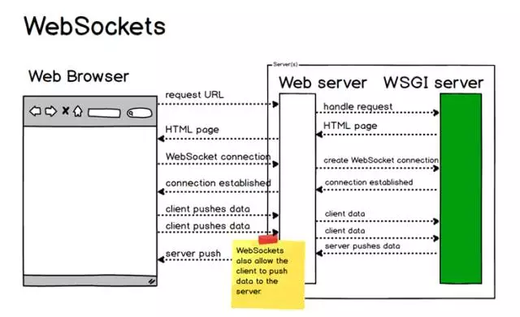
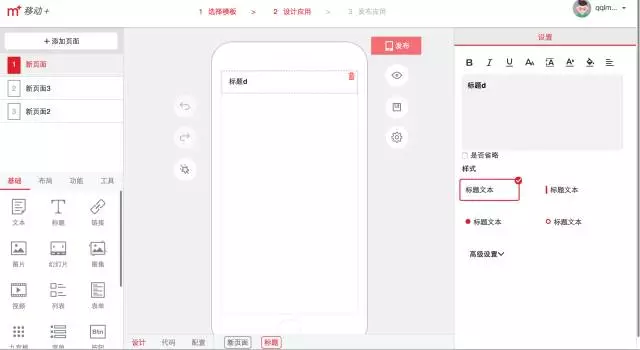
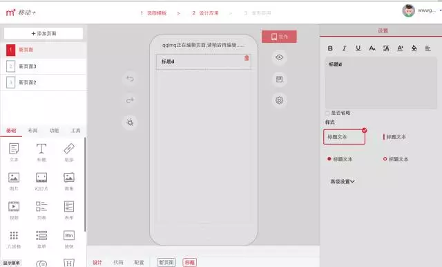
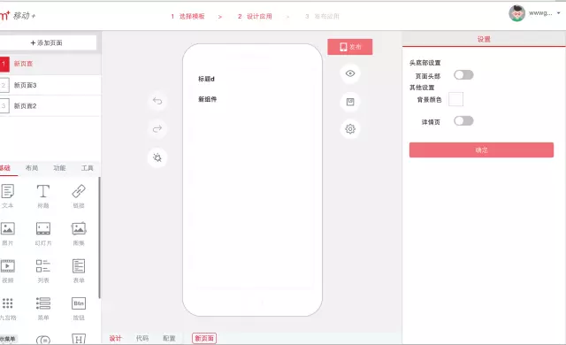
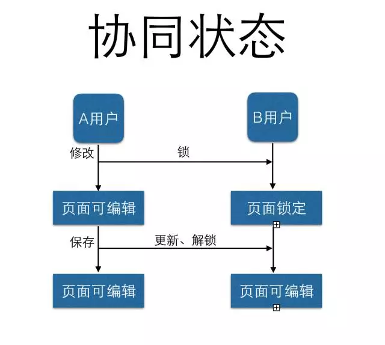

#说#
到WebSocket想比大家不会陌生，如果用一句话概括，那就是：


WebSocket protocol是HTML5一种新的协议，它实现了浏览器与服务器全双工通信。

相比较传统那些服务器，WebSocket的推送技术简直好了太多。

有了它，我们可以挥手向comet、长轮询这些技术说再见了，庆幸我们生活在拥有HTML5的时代。

得益于WebSocket，“移动+”在它的基础上实现了协同开发功能。

下面将分三个部分讲解“移动+”的协同开发功能：协同开发功能介绍，移动+协同原码解析，开发中踩过的坑。

1
协同开发功能介绍

“移动+”支持多人同时开发一个app，那么就涉及锁、合并、同步的问题。

还有一个最常见的问题是，如果1个以上的开发人员同时开发一个页面，那么可能其中一个人的修改会被另一个人的修改冲掉。

因此，我们提出了使用websocket来解决协同开发引发的这一系列问题。

功能目标

1、当1个以上用户同时开发同一个应用时，以页面为单位实现锁定，只允许1个用户编辑一个页面。其它用户被通知页面被锁定，并禁止编辑该页面。

2、当正在编辑的用户完成编辑保存时，通知其它用户页面开放 ，并更新被修改过的页面。

实现效果


页面没有编辑操作时，所有用户界面均无变化



当其中1个用户对页面进行操作时，其它用户的相应界面被锁定



当前用户操作完成保存后，其它用户的相应界面被修改

2
移动+协同功能原码解析

移动+ webSocket 后台是基于node开发的，主要使用ws的模块。

安装 ：npm install ws

官方示例代码

启动一个WebSocket服务

```javascript
var WebSocketServer = require('ws').Server
, wss = new WebSocketServer({ port: 8080 });

wss.on('connection', function connection(ws) {
	ws.on('message', function incoming(message) {
		console.log('received: %s', message);
});
ws.send('something');
});
```

前端Client js代码

```javascript
var WebSocket = require('ws');var ws = new WebSocket('ws://www.host.com/path');

ws.on('open', function open() {
	ws.send('something');
});

ws.on('message', function(data, flags) {
		// flags.binary will be set if a binary data is received.
		// flags.masked will be set if the data was masked.
});
```

ws模块使用很简单，启动服务设下message监听数据即可，主要的逻辑就是在message是对消息的封装、解包。

“移动+”coffee后台代码

ws-server.js 文件websocket 服务关键代码

引入ws模块

	ws = require('ws')
	WsServer = ws.Server

定义SocketServer 服务类：以server服务类为启动服务，这样可以统一http端口，避免前端跨域问题，path配置主要是生产中nginx代理拦截作用。

verifyClient 连接验证回调。

```coffee
SocketServer = (server) ->
	_this = this
	this.wss = new WsServer
		server: server
		clientTracking: true
		path: '/ws'
		# 连接验证
  		verifyClient: (info) ->
    			# params = _this.getParams info.req.url
    			return true
```

connection连接成功事件中监听message，判断数据流根据操作标识operate处理client连接。

数据流结构是自定义的，具体可以根据前端业务定义，这里主要定义了operate的四种状态：login，lock，look，close。

四种状态对应用户对应用户操作流程，具体看下面的流程图：

```coffee
this.wss.on 'connection', (ws) ->
    ws.on 'message', (data) ->
      return unless this.upgradeReq

      _data = JSON.parse data
      # 操作流
      switch _data.operate
        when "login"
          list = {}
          return unless list
          # 发送协作清单
          this.send JSON.stringify list

        when "lock"
          this.info = _data
          _this.broadcast (JSON.stringify _data), this.app_id, this.user_id

        when "look"
          this.info = _data
          _this.broadcast (JSON.stringify _data), this.app_id, this.user_id

        when "close"
          _this.broadcast (JSON.stringify _data), this.app_id, this.user_id

    # 连接关闭
    ws.on 'close', (code, message) ->
      _data = this.info
      return unless _data

      _data.operate = 'close'
      _this.broadcast (JSON.stringify _data), this.app_id, this.user_id

    # 连接错误
    ws.on 'error', (code, message) ->
      _data = this.info
      return unless _data
      _data = JSON.parse _data
      _data.operate = 'close'
      _this.broadcast (JSON.stringify _data), this.app_id, this.user_id

  return this
# 广播信息
SocketServer.prototype.broadcast = (data) ->
  this.wss.clients.forEach (client) =>
    client.send(data)
```

启动node http服务使用http server启动ws

```coffee
 WsService = require 'ws-service'
 http = require 'http'
 express = require 'express'

 app = express()
 server = http.createServer(app)
 server.listen process.env.PORT || 3000
 new WsService(server)
```

ws-client.js 关键代码对应服务端数据包

```javascript
function _init() {
  var host = window.document.location.host;
  this.ws = new WebSocket('ws://'+host+'/ws?id=xx&uid=xx');
  this.ws.onmessage = this.onmessage.bind(this);

  this.ws.onclose = function() {
    return null;
    console.info('WsClient 关闭....');
    this.intervalId = setInterval(function() {
      // this.ws.Reconnect();
      //console.info("WsClient 尝试重连");
    }.bind(this), 5000)
  }.bind(this);

  this.ws.onopen = function() {
    if (this.intervalId) {
      clearInterval(this.intervalId);
      this.intervalId = 0;
    }
    // 发送登录
    this.send({operate: "login"});
  }.bind(this);
  this.ws.onerror = function(err) {
    console.error(err);
  }
 }

function onmessage(event) {
  var data = event.data;
  if (!data)
    return ;
  data = JSON.parse(data);
  switch(data.operate){
    case "setcookie":
      setCookie(data.key, data.value, 24*60);
      break;
    case "close”:
      var _temp = _.findWhere(this.listData.items, {page_id: data.page_id, user_id: data.user_id});
      this.listData.items.splice(_index,1);
      break;
    case "look":
    case "lock":
      // 更新or新增用户状态
			var _temp = _.findWhere(this.listData.items, {page_id: data.page_id, user_id: data.user_id});
      if (_temp){
         _temp.operate = data.operate;
      } else {
        this.listData.items.push(data);
      }
      break;
    case "unlock":
      this.operate = "look"
      var _page = this.props.app.pages.findWhere({id: data.page_id});
      break;
    case "list”:
      //下拉列表
      this.listData = data;
      this.checkPageStateSend();
      break;
  }
}

function send(data) {
		if (!this.ws) return;
		this.ws.readyState == this.ws.OPEN && this.ws.send(JSON.stringify(data));
}
```




在整个流程中，主要逻辑都是在message监听中完成。ws-server负责管理所有协同数据的分发，ws-client负责当前用户的数据封装和解包服务推送的指令更新界面状态。

3
踩过的坑


跨域


这个问题估计做web前端开发都会遇到过，这是常见却经常踩的坑啊。

刚开始websockt服务是独立端口的，虽然是同一个域名下，但是不同的端口也是跨域；在移动+的协同开发中结合express框架，启动服务的时候统一在一个端口解决。

```comments
location /ws {
          proxy_pass http://appbricks;
          proxy_redirect off;

          proxy_http_version 1.1;
          proxy_set_header Upgrade $http_upgrade;
          proxy_set_header Connection "upgrade";
  }
```

部署生产nginx代理问题

部署生产nginx代理问题，nginx5.x以后就支持，网上搜一下配置解决，主要是启动统一拦截（/ws）匹配还是花了点时间，主要是ws模块二级目录pathg添加之后连接不成功，可能是与跨域问题滚在一起了，最后解决跨域之后二级目录就可以了。
